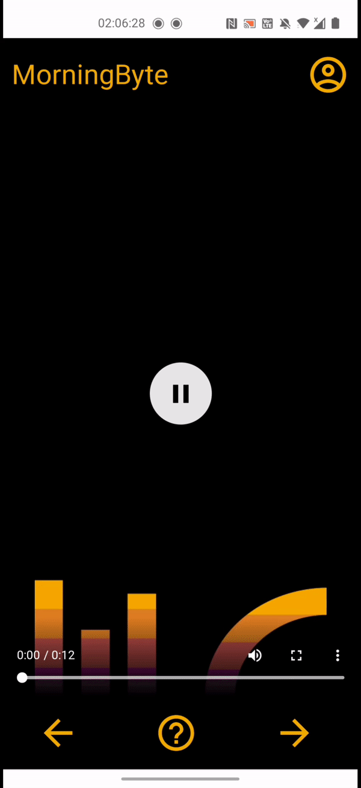

# MoriningByte
SAP challenge [@hackatum](https://hack.tum.de) 2021.
[See the project in action!](https://animated-data-stories-1.herokuapp.com/)

## Repository structure
|path|description|
|---|-----------|
|`dataset/`|the kaggle  [retail-sates-data](https://www.kaggle.com/berkayalan/retail-sales-data)|
|`exploratory_data_analysis/`|notebooks to explore the data|
|`scripts/`|scripts to generate insights and video stories|
|`assets/`|auxiliary files|
|`main.py`|run this to generate insights and stories and store them in a folder `videos`|
|`policy.xml`|needed to set up ImageMagick for MoviePy|
|`requirements.txt`|required packages to run `main.py`|

## Run the demo notebook to generate stories
### Prerequisites
#### Google Colab
Open [this notebook](https://colab.research.google.com/drive/1y0k3lBn_F00UHA3SiNzIDMv5Ve6vZmpb?usp=sharing) and follow its instructions

#### Local Setup
1. Download the dataset from https://www.kaggle.com/berkayalan/retail-sales-data/code
2. Insert the sales.csv file into the /dataset directory
3. Run `apt install imagemagick` on linux, or `brew install imagemagick` on Mac.
4. Run `pip install -r requirements.txt`

## React Webapp 
Checkout the branch 'heroku' for more information on the React App
